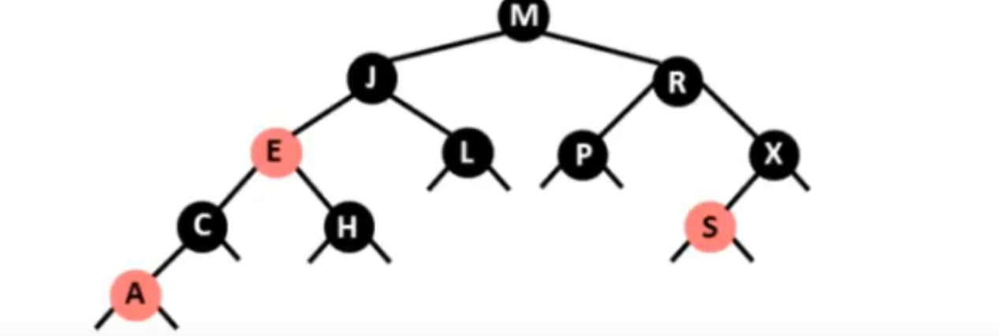
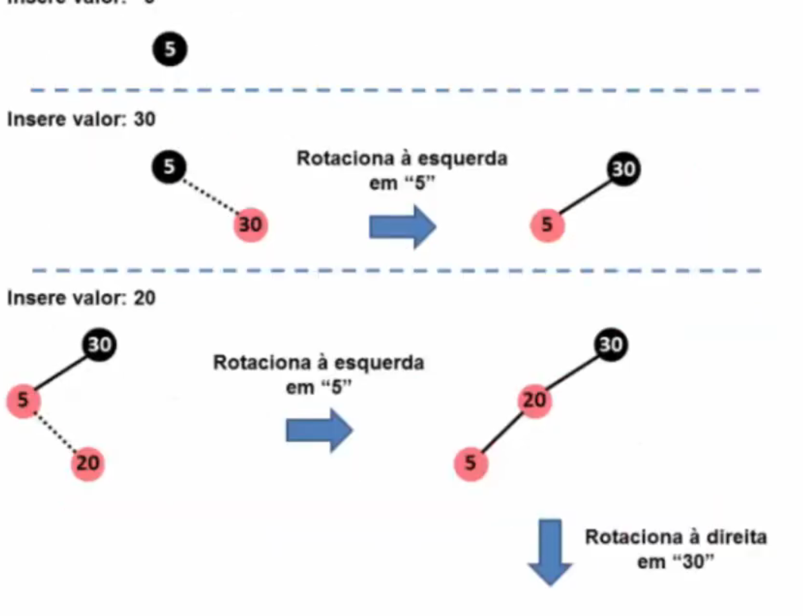
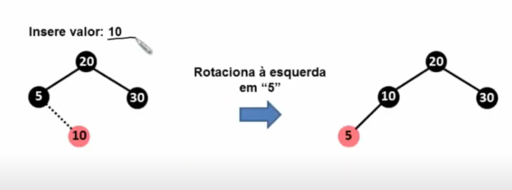
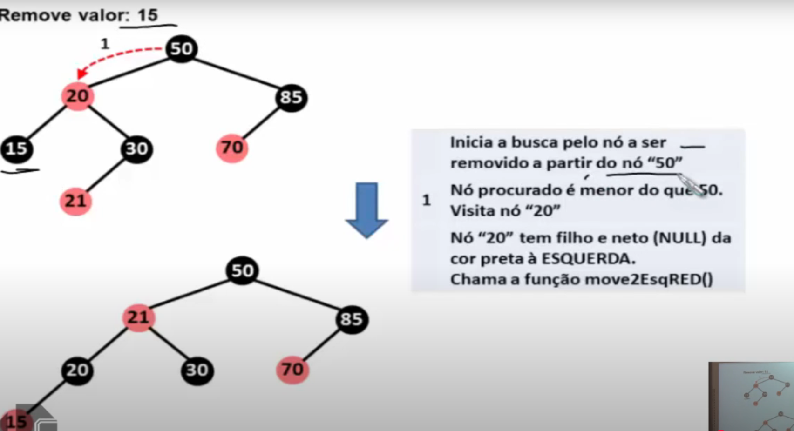

- E um tipo de arvore binaria balanceada.
- Utiliza um esquema de coloracao dos nos para manter o balanceamento da arvore.
- No da Arvore possui um atributo de cor que pode ser **"Vermelhos"** ou **"Preto"**.
- Permite rebalanceamento local:
	- apenas a parte afetada pelo **insercao** ou **remocao** e rebalanceada.
	- Uso de **rotacoes** e **ajuste de cores** na etapa de rebalanceamento.
	- Essas operacoes corrigem as propriedade que foram violadas.
- A arvore red-black busca manter-se como uma **arvore binaria quase completa**. 
	- Custo de qualquer algoritmo e maximo **O(logN)**.
---
#### Propriedades:

- Todo No da arvore e **"Vermelho"** ou **"Preto"**.
- A **Raiz** e sempre **preta**.
- Todo no folha(NULL) e **Preto**.
- Se um No e **Vermelho**, entao os seus filhos sao **Pretos**, ou seja, nao existem nos vermelhos consecutivos.
- Para cada No, todos os caminhos desse No para os Nos folhas descendentes contem o mesmo numero de Nos **Pretos**.

---
#### AVL x Red-Black:

- Na teoria, possuem a mesma complexidade computacional (insercao, remocao e busca): `O(logN)`
- Na pratica, a arvore AVL e mais rapida na operacao de busca, e mais lenta nas operacoes de insercao e remocao.
- A arvore AVL e mais balanceada do que a Red-Black, o que acelera a operacao de busca.
- Maior custo na operacao de insercao e remocao: no pior caso, uma operacao de remocao pode exigir `O(log N)` rotacoes na arvore AVL, mas apenas `3` rotacoes na arvore Red-Black.
- Se a aplicacao realiza de forma intensa a operacao de busca, e melhor usar uma Arvore AVL.
- Se a operacao mais usada e a insercao ou remocao, use uma arvore Red-Black
- Arvores Red-Black sao de uso mais geral do que as arvores AVL. Isso faz com que elas sejam utilizadas em diversas aplicacoes e bibliotecas de linguagens de programacao. Ex:
	- Java: java.util.TreeMap, java.util.TreeSet
	- C++ STL: map, multimap
	- Linux kernel.
---
#### Arvore Red-Black caida para a Esquerda(LLRB)

- E uma variante da arvore Red-Black que garante a mesma complexidade de operacoes, mas possui uma implementacao mais simples na insercao e remocao dos Nos.

- Satisfaz todas as propriedades da Red-Black convencional
- Possui uma propriedade extra: se um No e **Vermelho**, entao ele e o **filho esquerdo** do seu pai.
- Essa propriedade confere o seu aspecto de **caida para a esquerda**: os nos vermelhos sempre sao filho a esquerda
- Sua implementacao corresponde a implementacao de uma arvore 2-3 (nao e um arvore binaria).


- Numa arvore 2-3, cada no interno pode armazenar um ou dois valores e, dependendo da quantidade de valores armazenados, ter dois (um valor) ou tres (dois valores) filhos.
- Funcionamento igual ao da arvore binaria de busca. No caso de 3 sub-arvores, na sub-arvore do meio se encontram os elementos que sao **maiores** do que o **primeiro**, mas **menores** do que o **segundo** valor do No pai.
- Sua implementacao corresponde a implementacao de uma arvore 2-3 se considerarmos que o No **Vermelho** sera sempre um valor **menor** de um No contendo **dois valores** e 3 **Sub-Arvores**.
- Assim, balancear a arvore red-black equivale manipular uma arvore 2-3, uma tarefa muito mais simples do que manipular uma arvore AVL ou uma red-black convencional.
---
#### Implementacao de uma Red-Black

- Implementacao identida a da **Arvore Binaria** e da **AVL**.
- Para guardar o primeiro No da arvore utilizamos um **ponteiro para ponteiro**.
- Um **ponteiro para ponteiro** pode guardar o endereco de um **ponteiro**.
- Assim, fica facil mudar quem e a **raiz** da arvore (se necessario).
- Com excecao da **Insercao e da remocao**, as demais funcoes da **Arvore Red-Black** sao identicas a da **Arvore Binaria**.
###### Estrutura do No
```
#define RED 1
#define BLACK 0

typedef struct No{
	int valor;
	struct No *esquerda, *direita;
	int cor;
}NoAvr;
```

###### Funcoes para as Cores
```
int cor(NoAvr *raiz){
	if(raiz == NULL){
		return BLACK;
	} else {
		return raiz->cor;
	}
}

void trocaCor(NoAvr *raiz){
	raiz-cor = !raiz->cor;
	if(raiz->esquerda != NULL){
		raiz->esquerda->cor = !raiz->esquerda->cor
	}
	if(raiz->direita != NULL){
		raiz->direita->cor = !raiz->direita->cor
	}

}
```

###### Rotacao da Arvore Red-Black

- caida para a Esquerda - LLRB
- Operacao basica para balanceamento
- Dois tipos de rotacoes:
	- Rotacao a Esquerda.
	- Rotacao a Direita.
- Mais simples de implementar e de depurar em comparacao com as rotacoes da arvore AVL.
- Dado um conjunto de tres Nos, a rotacao visa deslocar um No Vermelhor que esteja a esquerda para a direita e vice-versa.
- A rotacao apenas atualiza ponteiros, de modo que a sua complexidade e `O(1)`.
```
# Rotacao a Esquerda
-> Recebe um No raiz com B como filho direito;
-> Move B para o lugar da raiz, raiz se torna o filho esquerdo de B;
-> B recebe a cor da raiz, raiz fica vermelho;

NoAvr* rotacionaEsquerda(NoAvr *raiz){
	NoAvr *B = raiz->direita;
	raiz->direita = B->esquerda;
	B->esquerda = raiz;
	B->cor = raiz->cor;
	raiz->cor = RED;
	return B;
}
```


```
# Rotacao a Direita
-> Recebe um No raiz com B como filho esquerdo;
-> Move B para o lugar da raiz, raiz se torna o filho direito de B;
-> B recebe a cor da raiz, raiz fica vermelho

NoAvr* rotacionaDireita(NoAvr *raiz){
	NoAvr *B = raiz->esquerda;
	raiz->direita = B->direita;
	B->direita = raiz;
	B->cor = raiz->cor;
	raiz->cor = RED;
	return B;
}
```


---
#### Mover os Nos Vermelhos
- Rotacoes e trocas de cores podem causa uma violacao das propriedades da arvores.
- Por exemplo, a funcao **trocaCor()** pode introduzir sucessivos Nos vermelhos a direita, o que viola uma das propriedades da arvore.
- Temos a necessidade de outras 3 funcoes (alem da rotacao) para restabelecer o balanceamento da arvore e garantir que as suas propriedade sao respeitadas:
	- Mover um No Vermelho para esquerda;
	- Mover um No vermelho para a direita;
	- Arrumar o balanceamento;
- Essas funcoes movimentam um No Vermelho para a sub-arvore esquerda ou direita, dependendo da situacao em que ele se encontra.
```
#Mover um No Vermelho para a esquerda
-> Recebe o No raiz e troca as cores dele e de seus filhos;
-> Se o filho a esquerda do filho direito e vermelho, aplicar uma rotacao a direita no filho direito e uma rotacao esquerda no pai;
-> Troca as cores do No pai e de seus filhos

NoAvr* move2EsqRED(NoAvr *raiz){
	trocaCor(raiz);
	if(cor(raiz->direita->esquerda) == RED){
		raiz->direita = rotacionaDireita(raiz->direita);
		raiz = rotacionaEsquerda(raiz);
		trocaCor(raiz);
	}
	return raiz;
}
```


```
# Mover um No vermelho para a direita
-> Recebe um No raiz e troca as cores dele e de seus filhos;
-> Se o filho a esquerda do filho esquerdo e vermelho, aplicar uma rotacao a direita no pai;
-> Troca as cores do No pai e de seus filhos;

NoAvr* move2DirRED(NoAvr *raiz){
	trocaCor(raiz);
	if(cor(raiz->esquerda->esquerda) == RED){
		raiz = rotacionaDireita(raiz);
		trocaCor(raiz);
	}
	return raiz;

}
```


```
# Arrumar o balanceamento
-> Se o filho direito e vermelho: rotacao a esquerda;
-> Se o filho direito e o neto da esquerda sao vermelhos: rotacao a direita;
-> Se ambos os filhos sao vermelhos: trocar a cor do pai e dos filhos;

NoAvr* balancear(NoAvr *raiz){

	if(cor(raiz->direita) == RED){
		raiz = rotacionaEsquerda(raiz);
	}

	if(raiz->esquerda != NULL && cor(raiz->direita) == RED && cor(raiz->esquerda->esquerda) == RED){
		raiz = rotacionaDireita(raiz);
	}

	if(cor(raiz->esquerda) == RED && cor(raiz->direita) == RED){
		trocaCor(raiz);
	}
	return raiz;

}
```
---
#### Insercao em uma Arvore Red-Black

- Para inserir um valor V na arvore:
	- **raiz e NULL:** insira o No;
	- **V e menor do que a raiz**: Va para a sub-arvore esquerda;
	- **V e maior do que a raiz:** Va para a sub-arvore direita;
	- aplique o metodo recursivamente;
	- Ao voltar na recursao, verifique as propriedades de cada sub-arvores
	- aplique a rotacao ou mudanca de cor necessaria se alguma propriedade foi violada;
```
NoAvr* insereNO(NoAvr *raiz, int valor, int *resp){
	if(raiz == NULL){
		NoAvr *novo;
		novo = malloc(sizeof(NoAvr));
		if(novo == NULL){
			*resp = 0;
			return NULL;
		}
		novo->valor = valor;
		novo->cor = RED;
		novo->direita = NULL;
		novo->esquerda = NULL;
		*resp = 1;
		return novo;
	}

	if(valor == raiz->valor){
		*resp = 0;
	} else {
		if(valor < raiz->valor){
			raiz->esquerda = insereNO(raiz->esquerda, valor, resp);
		} else {
			raiz->direita = insereNO(raiz->direita, valor, resp);
		}
	}

	if(cor(raiz->direita) == RED && cor(raiz->esquerda) == BLACK){
		raiz = rotacionaEsquerda(raiz);
	}

	if(cor(raiz->esquerda) == RED && cor(raiz->esquerda->esquerda) == BLACK){
		raiz = rotacionaDireita(raiz);
	}

	if(cor(raiz->esquerda) == RED && cor(raiz->direita) == RED){
		trocaCor(raiz);
	}

	return raiz;
}


int inserir(NoAvr *raiz, int valor){

	int resp;
	*raiz = insereNo(*raiz, valor, &resp);
	if((*raiz) != NULL){
		(*raiz)->cor = BLACK;
	}

	return resp;
}
```




---
#### Remocao em uma Arvore Red-Black

- Existem 3 tipos de remocao:
	- No folha (sem filhos)
	- No com 1 filho
	- No com 2 filhos
- Os 3 tipos de remocao trabalham juntos. A remocao sempre remove um elemento especifico da arvore, o qual pode ser um no folha, ter um ou dois filhos.
- **Cuidado**:
	- Nao se pode remover de uma arvore vazia
	- Removendo o ultimo No, a arvore fica vazia
- **Balanceamento**:
	- Ao voltar na recursao, verifique as propriedades de cada sub-arvore;
	- Aplique a rotacao ou mudanca de cor necessaria se alguma propriedade foi violada;
```
NoAvr* removerMenor(NoAvr *raiz){
	if(raiz->esquerda == NULL){
		free(raiz);
		return NULL;
	}
	if(cor(raiz->esquerda) == BLACK && cor(raiz->esquerda->esquerda) == BLACK){
		raiz = move2EsqRED(raiz);
	}

	raiz->esquerda = removerMenor(raiz->esquerda);
	return balancear(raiz);
}
```
```
NoAvr* procuraMenor(NoAvr *atual){
	NoAvr *aux1 = atual;
	NoAvr *aux2 = atual->esquerda;
	while(aux2 != NULL){
		aux1 = aux2;
		aux2 = aux2->esquerda;
	}
	return aux1;

}
```
```
NoAvr* removeNo(NoAvr *raiz, int valor){
	if(valor < raiz->valor){
		if(cor(raiz->esquerda) == BLACK && cor(raiz->esquerda->esquerda) == BLACK{
			raiz = move2EsqRED(raiz);
		}

		raiz->esquerda = removeNO(raiz->esquerda, valor);
	} else {
		if(cor(raiz->esquerda) == RED){
			raiz = rotacionaDireita(raiz);
		}

		if(valor == raiz->valor && (raiz->direita == NULL)){
			free(raiz);
			return NULL;
		}

		if(cor(raiz->direita) == BLACK && cor(raiz->direita->esquerda) == BLACK){
			raiz = move2DirRED(raiz);
		}

		if(valor == raiz->valor){
			NoAvr *aux = procuraMenor(raiz->direita);
			raiz->valor = aux->valor;
			raiz->direita = removerMenor(raiz->direita);
		} else {
			raiz->direita = removeNO(raiz->direita, valor);
		}
	}
	return balancear(raiz);

}


```
```
int remove(NoAvr *raiz, int valor){

	if(consulta_Avr(raiz,valor)){
		NoAvr *aux = *raiz;
		*raiz = removeNO(aux, valor);
		if(*raiz != NULL){
			(*raiz)->cor = BLACK;
		}
		return 1;
	}else {
		return 0;
	}
}
```

