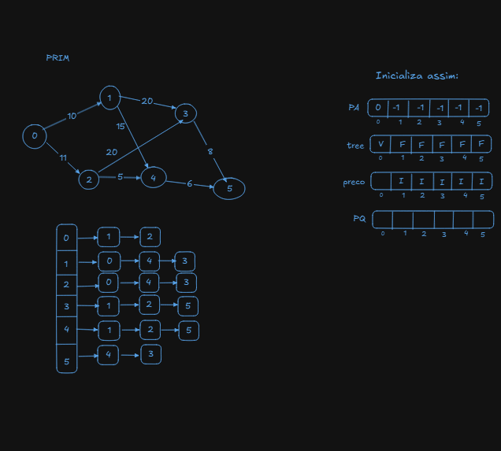
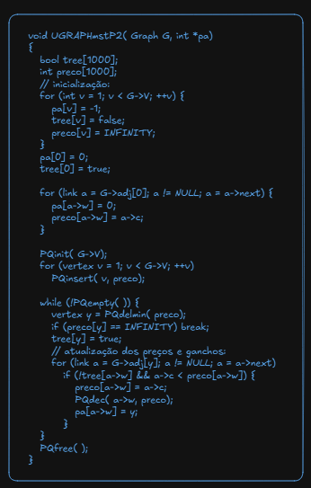
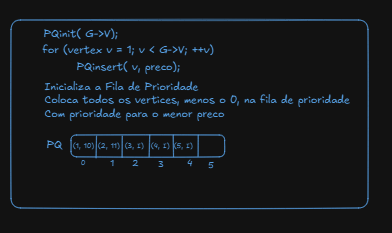
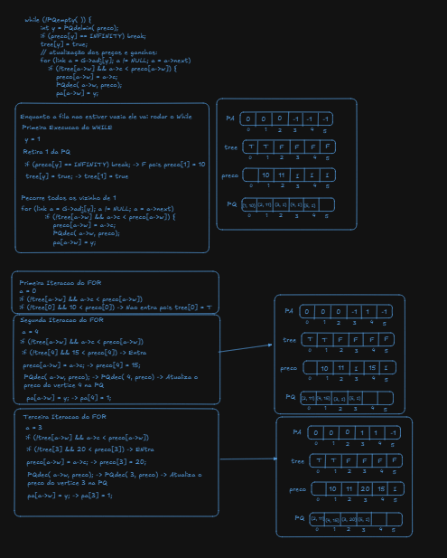

- Forma de Implementacao ingênua
```
void UGRAPHmstP0(Graph G,int *pa)
{ 
   for (int w = 0; w < G->V; w++){
	   pa[w] = -1;
   }
   pa[0] = 0; 
   while (true) {
      int min = INFINITY;
      int x, y;
      for (int v = 0; v < G->V; v++) {
         if (pa[v] == -1) continue;
         for (link a = G->adj[v]; a != NULL; a = a->next)
            if (pa[a->w] == -1 && a->c < min) {
               min = a->c;
               x = v, y = a->w;
            }
      }
      if (min == INFINITY) break;
      pa[y] = x;
   }
}
```

#### Funcao:
```
void UGRAPHmstP0(Graph G,int *pa)
```
- Assinatura da função
	- Recebe `G`, o grafo não‑dirigido representado por listas de adjacência.
	- Recebe `pa`, um vetor de tamanho `G->V` que será preenchido com o pai de cada vértice na MST.

#### Loop de inicialização
```
for (int w = 0; w < G->V; w++)
   pa[w] = -1;
```
- Loop de inicialização
	- Itera `w` de `0` até `G->V - 1`.
	- Define `pa[w] = -1`, marcando **todos** os vértices como “não pertencentes” ainda à MST.

#### Raiz da MST
```
pa[0] = 0;
```
- Marca o vértice `0` como pertencente à MST.
- Como convenção, `pa[0] = 0` diz “pai de 0 é ele mesmo” — ou simplesmente “0 já está na árvore”

#### Início do loop principal
```
while (true) {
```
- Repetirá indefinidamente até encontrar um `break` interno.

#### Setup de variáveis temporárias
```
   int min = INFINITY;
   int x, y;
```
- `min` guardará, nesta iteração, o menor peso de aresta encontrado.
- `x` e `y` serão os extremos dessa aresta: `x` dentro da MST, `y` ainda de fora.

#### Loop sobre vértices “na árvore”
```
   for (int v = 0; v < G->V; ++v) {
      if (pa[v] == -1) continue;
```
- Para cada `v` de `0` a `V-1`, verifica `pa[v]`:
	- Se `pa[v] == -1`, **pula** (`continue`) porque `v` ainda não entrou na MST.
	- Caso contrário, `v` já faz parte da MST e deve “olhar” suas arestas.

#### Percorre lista de adjacência de `v`
```
 for (link a = G->adj[v]; a != NULL; a = a->next)
```
- Percorre lista de adjacência de `v`
	- Cada `a` aponta para uma aresta `(v → a->w)` com peso `a->c`.
	- Vai de `G->adj[v]` até o fim da lista (`a == NULL`).

#### Teste e atualização da aresta candidata
```
         if (pa[a->w] == -1 && a->c < min) {
            min = a->c;
            x = v;
            y = a->w;
         }

```
- `pa[a->w] == -1` assegura que o vizinho `w` está **fora** da MST.
- `a->c < min` verifica se essa aresta é **mais leve** que todas as vistas até agora.
- Se sim, atualiza:
	- `min = a->c` (menor peso atual),
	- `x = v` (extremo na árvore),
	- `y = a->w` (novo extremo a incorporar).

#### Condição de parada
```
   if (min == INFINITY)
      break;
```
- Se **nenhuma** aresta válida foi encontrada (`min` não mudou de `INFINITY`), então **todas** as fronteiras possíveis já foram exploradas.
- Não há mais vértices a adicionar: sai do `while`.

#### Incorporação do novo vértice
```
   pa[y] = x;
```
- Marca `y` como parte da MST atribuindo `x` como seu pai.
- Implicitamente, `pa[y] != -1` fará com que, na próxima iteração, `y` seja incluído na busca de arestas de saída.

#### Encerramento
```
}  // fim do while
}  // fim da função
```
- Ao fim do `while`, o vetor `pa[0..V-1]` representa toda a MST:
	- Para cada `v ≠ 0`, `pa[v]` é o vértice anterior na árvore.
	- Para `v = 0`, `pa[0] = 0` (raiz).

---




