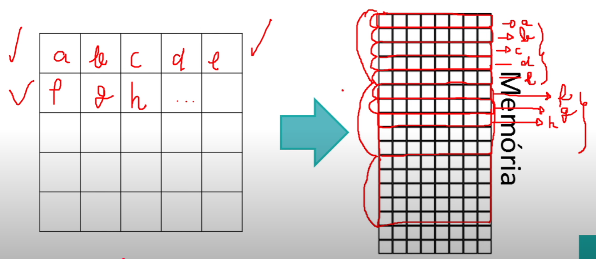
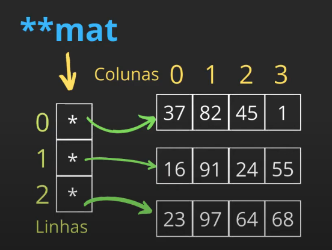

### 1. Matrizes
- Matrizes podem ter varias dimensoes
- Dois ou mais indices para acesso a posicoes
	- Sintaxe:
	 `<tipo> <nome> [<dim1>][<dim2>] ... [<dimN>];`

---
### 2. Matrizes em memoria


---
### 3. Manipulando uma matriz
- Sintaxe de acesso a posicao:
	`<nome>[<i1>][<i2>] ... [<iN>]`
- Sintaxe de inicializacao:
	`<declaracao> = {{<l1>}, {<l2>},...,{<lN>}};`

```
int main(){

	int mat[3][3];

	mat[0][0] = 1;
	mat[0][1] = 2;
	mat[0][2] = 3;

	mat[1][0] = 4;
	mat[1][1] = 5;
	mat[1][2] = 6;

	mat[2][0] = 7;
	mat[2][1] = 8;
	mat[2][2] = 9;

	printf("%d %d %d\n", mat[0][0], mat[0][1], mat[0][2]);
	// Imprime a primeira linha da matriz
}
```

| 1   | 2   | 3   |
| --- | --- | --- |
| 4   | 5   | 6   |
| 7   | 8   | 9   |

```
int main(){
	int mat[3][3] = {{1,2,3}, {4,5,6}, {7,8,9}};
	int i,j;

	for(j=0;j<3;j++){ // Outra forma de imprimir a primeira linha
		printf("%d ", mat[0][j])
	}

	for(i=0;i<3;i++){ // Imprime a matriz inteira
		for(j=0;j<3;j++){
			printf("%d ", mat[i][j])
		}
		printf("\n")
	}
}
```

--- 
### 4. Matriz dinamica

- Vetor de vetores:
	int* -> 10 27 32
	int* -> 11 75 49
	int* -> 43 82 10
	int* -> 12 47 62
- Precisa usar ponteiro de ponteiro

```
int main(){

	int **mat, i, j;

	mat = malloc(4 * sizeof(int*));

	for(i=0; i<4; i++){
		mat[i] = malloc(3 * sizeof(int));
	}

	srand(time(NULL));

	for(i = 0; i<4; i++){
		for(j=0; j<3; j++){
			mat[i][j] = rand() % 100;
		printf("\n");`
		}
	}

	for(i = 0; i<4; i++){
		for(j=0; j<3; j++){
			printf("%d ", mat[i][j]);
		}
	}
	
}
```

---
### 5. Percorrer uma matriz dinamica

```
int main(){

	int **mat, i, j;

	mat = malloc(4 * sizeof(int*));

	for(i=0; i<4; i++){
		mat[i] = malloc(3 * sizeof(int));
	}
	
	srand(time(NULL));

	for(i = 0; i<4; i++){
		for(j=0; j<3; j++){
			*(*(mat + i) + j) = rand() % 100;
 		printf("\n");`
		}
	}

	for(i = 0; i<4; i++){
		for(j=0; j<3; j++){
			printf("%d ", *(*(mat + i) + j));
		}
	}
}
```