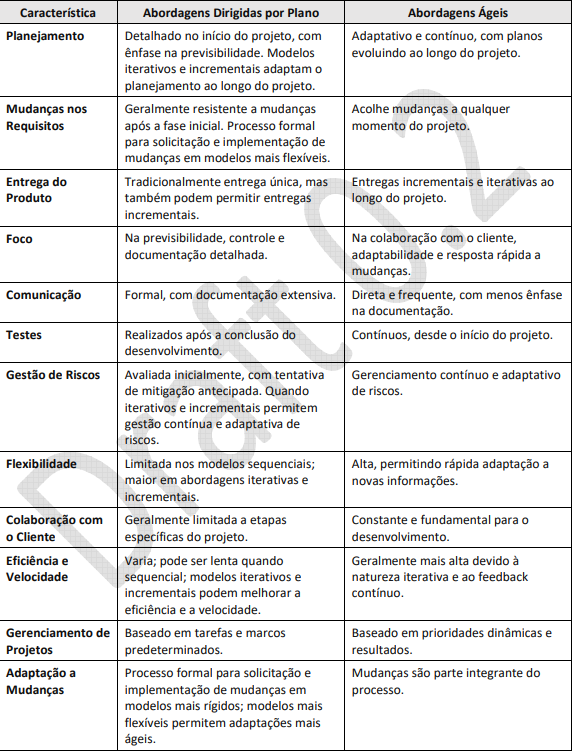
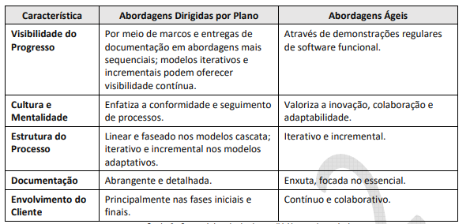

## 1. Abordagens, Ciclos de Vida e Processos de Desenvolvimento de Software

---
### 1.1 Abordagens de Desenvolvimento de Software

#### 1.1.1 Dirigidas por Plano

- Foca no planejamento e na previsibilidade.
- Documentacao detalhada em todas as fases do desenvolvimento.
- Para ser eficar e necessario que os requisitos de software sejam identificados de forma abrangente ou quase completa no inicio do projeto.
- Os requisitos tem que ser estaveis e conhecidos, caso contrario a utilizacao dessa abordagem pode se tornar inadequada.
- O conjunto de requisitos gera insumo para o planejamento detalhado, incluindo dimensionamento da equipe, indentificacao de pre-requisitos tecnicos, riscos, restricoes, estimativas de custos, prazos e planos de entrega.
- Menos adequadas para o desenvolvimento rapido de software, pois envolvem mais planejamento, requisitos estaveis e formalismos.
- Exemplos de situacoes que essa abordagem melhor se encaixa:
	- Quando varios times de desenvolvimento precisam ser coordenados.
	- Quando o produto de software e critico.
	- Quando muitas pessoas estarao envolvidas na manutencao do software ao longo de sua vida util.
	- Quando nao e viavel uma comunicacao constante entres os envolvidos.
- O controle de mudancas e formal e estruturado, tornando o processo menos flexivel, o que pode ser beneficio em ambientes onde a estabilidade e a conformidade com regulamentacoes sao prioritarias.
- **Valores**:
	- `Estabilidade`: valoriza-se a estabilidade do escopo do projeto e a minimizacao de mudancas.
	- `Seguranca`: acredita-se que um planejamento detalhado e uma documentacao abrangente proporcionam uma base segura para o desenvolvimento e a manutencao futura.
	- `Previsao`: valoriza-se a capacidade de prever resultados, custos e cronogramas com precisao.
- **Principios**:
	- `Previsibilidade e Planejamente`: Tarefas, recursos e cronogramas sao definidos antecipadamente para minimizar riscos e incertezas.
	- `Estrutura Faseada`: Fases sequenciais, onde cada fase deve ser completada antes de se avancar para a proxima.
	- `Documentacao Abrangente`: Grande enfase na criacao de documentacao detalhada em cada fase do desenvolvimento.
	- `Controle Rigoroso`
	- `Gerenciamento de Mudancas Formal`

- `Embora as abordagens dirigidas por plano tenham sido amplamente utilizadas e sejam adequadas para projetos com requisitos bem definidos e estaveis, elas enfrentam criticas por sua rigidez e dificuldade em acomodar mudancas`.
---
#### 1.1.2 Ageis

- Principios de **flexibilidade, colaboracao e resposta rapida a mudancas**. 
- Metodos ageis, como Scrum e XP, destacam o desenvolvimento iterativo e incremental, em que o projeto e divido em pequenas iteracoes, cada uma resultando em um incremento do software.
- Enfase na comunicacao continua e colaboracao com o cliente.
- Abordagens ageis sao adequadas em produtos de software voltados para negocios, em ambientes instaveis e sujeito a mudancas constantes.
- Valoriza os processos de desenvolvimento e entregas rapidas.
- Documentacao minimizada.
- **Valores Ageis**:
	- `Individuos e interacoes`: valoriza as pessoas que fazem o trabalho e como elas trabalham juntas.
	- `Software Funcionando`: Da mais valor ao desenvolvimento de software funcional do que a criacao de documentacao extensa.
	- `Colaboracao com o cliente`: Prioriza a colaboracao continua com o cliente ao longo do projeto.
	- `Responder a mudancas`: Valoriza a capacidade de adaptar-se a mudancas ao longo do desenvolvimento do projeto.
- **Principios Ageis**:
	- `Satisfacao do cliente`
	- `Aceitar mudancas nos requisitos`
	- `Software Funcional`
	- `Trabalho conjunto diario`
	- `Comunicacao face a face`
	- `Ritmo sustentavel de trabalho para a equipe`
	- `Simplicidade e essencial`

- `Os valores e princípios ágeis destacam a importância da flexibilidade, colaboração, foco no cliente e entrega continua de valor. Eles formam a base para diversos processos e frameworks ágeis, como Extreme Programming (XP), Scrum e Kanban, cada um aplicando esses valores e princípios de maneira que se adaptem ao contexto e aos objetivos específicos do projeto de software.`
---
#### 1.1.3 Comparacao Dirigido por plano X Agil

---
#### 1.1.4 Abordagens Hibridas

- Combinam elementos das duas abordagens anteriores
- Planejamento e Adaptabilidade
- Documentacao Formal e Comunicacao informal
- Precessos estruturados e flexibilidade situacional
- Controle de Gorvernanca e Autonomia das equipes
- **Valores e Principios Hibridos**:
	- `Adaptacao Contextual`
	- `Equilibrio Pragmatico`
	- `Comunicacao Multifacetada`
	- `Governanca Escalonada`
- Frameworks como SAFe representam tentativas estruturadas de implementar abordagens hibridas.

---
#### 1.1.5 Como lidam com requisitos

Dirigida por Plano:
- Os requisitos guiam o planejamento de recursos e prazos.
![[Pasted image 20250423181122.png]]

Ageis:
- Os recursos e prazos guiam o desenvolvimento do software
![[Pasted image 20250423181230.png]]

Hibridas:
- Requisitos, recursos e prazos guiam o desenvolvimento.
![[Pasted image 20250423181332.png]]
![[Pasted image 20250423181503.png]]

---
### 1.2 Ciclos de Vida

#### 1.2.1 Ciclos de vida de Software

- Fatores para escolher um ciclo de vida: Estabilidade dos requisitos, Tolerancia a riscos e necessidade de entrega.
![[Pasted image 20250423181732.png]]

##### Ciclo de Vida Preditivo

- Progressao linear e sequencial por meio de fases
- Uma vez que um fase e concluida, o desenvolvimento passa para a proxima fase sem retornar a fase anterior.
- Adequado para projetos com requisitos bem definidos e pouco propensos a mudancas, ou seja, conhecidos e estaveis.
- Entrega do produto somente ao final da realizacao de todas as fases.
![[Pasted image 20250423182023.png]]

##### Ciclo de vida Iterativo

- Repeticao de atividades de desenvolvimento em ciclos, permitindo ajustes baseados no aprendizado e feedback.
![[Pasted image 20250423182138.png]]

##### Ciclo de Vida incremental

- Entrega varios incrementos (partes funcionais) ao longo do desenvolvimento, onde cada uma delas ja pode ser passivel de utilizacao.
![[Pasted image 20250423182251.png]]

##### Ciclo de Vida Iterativo e Incremental

- Realizacao do trabalho em ciclos sucessivos (iteracoes).
- Cada iteracao produz uma versao incrementada do software, adicionando novas funcionalidades de forma gradual ate que o produto final esteja completo.
![[Pasted image 20250423182443.png]]

##### Ciclo de Vida Agil

- Entrega continua de partes funcionais do software ao cliente para feedback rapido.
- Fornece visibilidade, confianca e controle do produto ao cliente.
![[Pasted image 20250423182719.png]]

##### Caracteristicas

![[Pasted image 20250423182747.png]]
